_Japanese translation from [the original post](http://jakearchibald.com/2014/offline-cookbook/) in English._

_原文: [The offline cookbook by Jake Archibald] (http://jakearchibald.com/2014/offline-cookbook/)_

#オフラインクックブック
_投稿日：2014年12月9日_

> When AppCache arrived on the scene it gave us a couple of patterns to make content work offline. If those were the patterns you needed, congratulations, you won the AppCache lottery (the jackpot remains unclaimed), but the rest of us were left huddled in a corner [rocking back & forth](http://alistapart.com/article/application-cache-is-a-douchebag).

最初に登場したのはアプリケーションキャッシュ（AppCache）でした。AppCacheはコンテンツをオフラインでアクセスするための２つのパターンを提供します。もしそれらのパターンがあなたのニーズに一致していたとしたら、あなたはとてもラッキーです。なぜなら、それは宝くじに当たったも同然なのですから。（未だに当選者は現れていませんが。）一方、アンラッキーな残りの大多数である我々は、どうすればよいのか分からずに部屋の片隅で[右往左往](http://alistapart.com/article/application-cache-is-a-douchebag)するばかりです。

> With ServiceWorker ([intro](http://www.html5rocks.com/ja/tutorials/service-worker/introduction/)) we gave up trying to solve offline, and gave developers the moving parts to go solve it themselves. It gives you control over caching and how requests are handled. That means you get to create your own patterns. Let's take a look at a few possible patterns in isolation, but in practice you'll likely use many of them in tandem depending on URL & context.

そして[Service Worker](http://www.html5rocks.com/ja/tutorials/service-worker/introduction/)が登場しました。Service Workerでは、ブラウザはオフライン機能そのものを提供するのではなく、アプリケーションの開発者が自身で問題を解決できるように、低レベルな部品を提供することに努めました。それにより、開発者はキャッシュやリクエスト処理をより細かくコントロールできるようになったのです。それはまた、開発者自身がデザインパターンを考えなければならないことを意味します。この記事では、考えられるパターンをひとつづつ取り上げて見ていきます。実際にはアプリケーションのURLやコンテキストに基づいて、複数のパターンを組み合わせて使用することになると思います。

> All code examples work today in [Chrome 40 beta](https://www.google.com/chrome/browser/beta.html) with the [cache polyfill](https://github.com/coonsta/cache-polyfill), unless otherwise noted. This stuff will land into the stable version January/February 2015 barring any emergencies, so it won't be long until millions of real users can benefit from this stuff.

記事中のすべてのサンプルコードは、特に言及しない限り Chrome 40以降と [Cache polyfill](https://github.com/coonsta/cache-polyfill)を使って動作させることができます。

> For a working demo of some of these patterns, see [Trained-to-thrill](https://jakearchibald.github.io/trained-to-thrill/), and [this video](https://www.youtube.com/watch?v=px-J9Ghvcx4) showing the performance impact.

また、本記事で紹介するいくつかのパターンを実際に使ったアプリケーション[Trained-to-thrill](https://jakearchibald.github.io/trained-to-thrill/)と、そのパフォーマンスの改善結果がわかる[動画](https://www.youtube.com/watch?v=px-J9Ghvcx4)も参照ください。

**目次**

1. [キャッシュ更新の８つのパターン](#the-cache-machine-when-to-store-resources)
 1. [パターン１：`install`イベント時に依存ファイルをキャッシュに保存する](#on-install-as-a-dependency)
 2. [パターン２：`install`イベント時に非依存ファイルをキャッシュに保存する](#on-install-not-as-a-dependency)
 3. [パターン３：`activate`イベント時に不要なファイルをキャッシュから削除する](#on-activate)
 4. [パターン４：ユーザーの操作によりファイルをキャッシュに保存する](#on-user-interaction)
 5. [パターン５：`fetch`イベント時にレスポンスをキャッシュに保存する](#on-network-response)
 6. [パターン６：Stale-while-revalidate](#stale-while-revalidate)
 7. [パターン７：On push message](#on-push-message)
 8. [パターン８：On background-sync](#on-background-sync)
2. [キャッシュの持続性](#cache-persistence)
3. [リクエスト処理の８つのパターン](#serving-suggestions-responding-to-requests)
 1. [パターン１：Cache only](#cache-only)
 2. [パターン２：Network only](#network-only)
 3. [パターン３：Cache, falling back to network](#cache-falling-back-to-network)
 4. [パターン４：Cache & network race](#cache-network-race)
 5. [パターン５：Network falling back to cache](#network-falling-back-to-cache)
 6. [パターン６：Cache then network](#cache-then-network)
 7. [パターン７：Generic fallback](#generic-fallback)
 8. [パターン８：ServiceWorker-side templating](#serviceworker-side-templating)
4. [まとめ](#putting-it-together)

##<a name="the-cache-machine-when-to-store-resources"></a>キャッシュ更新の８つのパターン

> ServiceWorker lets you handle requests independently from caching, so we'll look at them separately. First up, caching, when should it be done?

Service Workerでは、リクエストとキャッシュは独立したものとして扱われます。本記事でもそれらを分けて説明します。まずはキャッシュに関して、どのタイミングでキャッシュを書き込むかという点に着目し、いくつかのパターンを考えましょう。

###<a name="on-install-as-a-dependency"></a>パターン１：`install`イベント時に依存ファイルをキャッシュに保存する

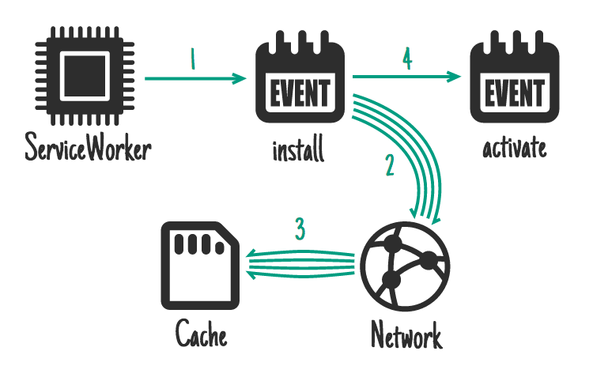

> ServiceWorker gives you an install event. You can use this to get stuff ready, stuff that must be ready before you handle other events. While this happens any previous version of your ServiceWorker is still running & serving pages, so the things you do here mustn't disrupt that.

Service Worker は`install`イベントを受け取ります。`install`イベントでは、他のイベントを処理する前にやっておくべき準備を行います。ここで注意しないといけないことは、Service Wrokerが更新されたとき、`install`イベントの時点では、まだ古いService Workerによりページが提供されているということです。つまり、`install`イベントで行う処理が、現在のページの動作に影響を与えないように注意する必要があります。

> **Ideal for:** CSS, images, fonts, JS, templates… basically anything you'd consider static to that "version" of your site.

**このパターンが適するのは：**アプリケーションの特定のバージョンを構成するCSS、画像、フォント、JavaScript、テンプレート等、基本的にすべての静的なファイル。

> These are things that would make your site entirely non-functional if they failed to fetch, things an equivalent native-app would make part of the initial download.

これらのファイルはアプリケーションにとって必要不可欠なものであり、ネイティブアプリのインストーラに含まれるファイルと同等です。

```js
self.addEventListener('install', function(event) {
  event.waitUntil(
    caches.open('mysite-static-v3').then(function(cache) {
      return cache.addAll([
        '/css/whatever-v3.css',
        '/css/imgs/sprites-v6.png',
        '/css/fonts/whatever-v8.woff',
        '/js/all-min-v4.js'
        // etc
      ]);
    })
  );
});
```

> `event.waitUntil` takes a promise to define the length & success of the install. If the promise rejects, the installation is considered a failure and this ServiceWorker will be abandoned (if an older version is running, it'll be left intact). `caches.open` and `cache.addAll` return promises. If any of the resources fail to fetch, the `cache.addAll` call rejects.

`event.waitUntil`はPromiseオブジェクトを受け取ります。このPromiseオブジェクトではインストールの一連の処理が定義されます。もしPromiseがrejectされた場合、インストールは失敗し、Service Workerはインストールされません。（古いバージョンのService Workerがあれば、それは影響を受けません。）`cache.open`と`cache.addAll`はどちらもPromiseオブジェクトを返します。ここで取得するリソースのうち、ひとつでも取得に失敗すれば、`cache.addAll`の呼び出しはrejectされます。

> On [trained-to-thrill](https://jakearchibald.github.io/trained-to-thrill/) I use this to [cache static assets](https://github.com/jakearchibald/trained-to-thrill/blob/3291dd40923346e3cc9c83ae527004d502e0464f/www/static/js-unmin/sw/index.js#L3).

サンプルアプリケーションの[trained-to-thrill](https://jakearchibald.github.io/trained-to-thrill/)では、すべての静的なアセットを`install`イベントで[キャッシュに保存しています](https://github.com/jakearchibald/trained-to-thrill/blob/3291dd40923346e3cc9c83ae527004d502e0464f/www/static/js-unmin/sw/index.js#L3)。

###<a name="on-install-not-as-a-dependency"></a>パターン２：`install`イベント時に非依存ファイルをキャッシュに保存する

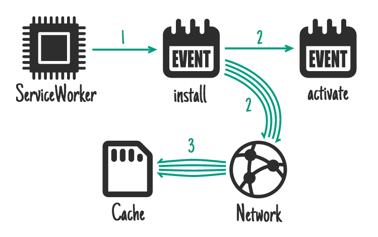

> Similar to above, but won't delay install completing and won't cause installation to fail if caching fails.

パターン１に似ていますが、インストール完了まで待たず、またキャッシュ保存が失敗してもインストール自体は失敗しない点が異なります。

> **Ideal for:** Bigger resources that aren't needed straight away, such as assets for later levels of a game.

**このパターンが適するのは：**サイズが大きく、直接アプリケーションの動作に必要ないリソース。例えば、ゲームの後半のレベルで使用されるアセット等。

```js
self.addEventListener('install', function(event) {
  event.waitUntil(
    caches.open('mygame-core-v1').then(function(cache) {
      cache.addAll(
        // levels 11-100
      );
      return cache.addAll(
        // core assets & levels 1-10
      );
    })
  );
});
```

> We're not passing the `cache.addAll` promise for levels 11-100 back to `event.waitUntil`, so even if it fails, the game will still be available offline. Of course, you'll have to cater for the possible absence of those levels & reattempt caching them if they're missing.

ここでは`cache.addAll`を２回呼び出してますが、前者の"levels 11-100"の方は戻り値のPromiseオブジェクトを`event.waitUntil`に渡していません。これにより、もし"levels 11-100"のデータが取得できなくても、Service Workerはインストールされ、アプリケーションはオフラインで動作します。もちろん、アプリケーションはそれらのデータが取得できなかった場合を想定した作りになっている必要があります。

> Also, the ServiceWorker may be killed while levels 11-100 download since it's finished handling events, but the download will continue in the background.

また、"levels 11-100"のデータ取得中にService Workerが強制終了する場合もあります。これは"levels 11-100"以外のデータをキャッシュに保存した時点でイベント処理は完了したとみなされるからです。この場合、Service Workerが終了しても"levels 11-100"のダウンロードはバックグラウンドで継続します。

###<a name="on-activate"></a>パターン３：`activate`イベント時に不要なファイルをキャッシュから削除する


> **Ideal for:** Clean-up & migration.

**このパターンが適するのは：**キャッシュの後片付け、およびIndexedDBのスキーマのマイグレーション。

> Once a new ServiceWorker has installed & a previous version isn't being used, the new one activates, and you get an activate event. Because the old version is out of the way, it's a good time to handle schema migrations in IndexedDB and also delete unused caches.

ひとたびService Workerがインストールされて、古いバージョンのService Workerにより提供されていたページが閉じられると、新しいバージョンに対して`activate`イベントが発行されます。古いバージョンはもう使用されることはないため、ここで不要なキャッシュの削除や、IndexedDBのスキーマのマイグレーション処理を行います。

```js
self.addEventListener('activate', function(event) {
  event.waitUntil(
    caches.keys().then(function(cacheNames) {
      return Promise.all(
        cacheNames.filter(function(cacheName) {
          // Return true if you want to remove this cache,
          // but remember that caches are shared across
          // the whole origin
        }).map(function(cacheName) {
          return caches.delete(cacheName);
        })
      );
    })
  );
});
```

> During activation, other events such as `fetch` are put into a queue, so a long activation could potentially block page loads. Keep your activation as lean as possible, only use it for things you _couldn't_ do while the old version was active.

`activate`イベントを処理している間、他のイベント（`fetch`イベント等）は待たされることになります。つまり、`activate`イベントの処理が長引くと、ページのロードがブロックされる可能性があります。`activate`で行う処理はなるべく手短に済ませるようにし、古いバージョンのService Workerが動作しているときには実行できなかった処理のみをここで行ってください。

> On [trained-to-thrill](https://jakearchibald.github.io/trained-to-thrill/) I use this to [remove old caches](https://github.com/jakearchibald/trained-to-thrill/blob/3291dd40923346e3cc9c83ae527004d502e0464f/www/static/js-unmin/sw/index.js#L17).

サンプルアプリケーションの[trained-to-thrill](https://jakearchibald.github.io/trained-to-thrill/)では、不要となったファイルを`activate`イベントで[キャッシュから削除しています](https://github.com/jakearchibald/trained-to-thrill/blob/3291dd40923346e3cc9c83ae527004d502e0464f/www/static/js-unmin/sw/index.js#L17)。

###<a name="on-user-interaction"></a>ユーザーの操作によりファイルをキャッシュに保存する

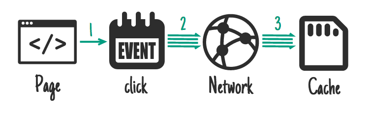

> **Ideal for:** If the whole site can't be taken offline, you may allow the user to select the content they want available offline. E.g. a video on something like YouTube, an article on Wikipedia, a particular gallery on Flickr.

**このパターンが適するのは：**アプリケーション全体をオフラインで利用可能にするのが現実的でない場合、オフラインで利用したいコンテンツをユーザーに選択させる。例えば、YouTubeの動画、Wikipediaの記事、Flickrのギャラリー等において、特定なコンテンツのみをキャッシュに保存する。

> Give the user a "Read later" or "Save for offline" button. When it's clicked, fetch what you need from the network & pop it in the cache.

このパターンでは、ユーザーに「後で読む」ボタンや「オフライン視聴向けに保存」ボタン等のUIを提供して、ネットワークからファイルを読み込み、キャッシュに保存します。

```js
document.querySelector('.cache-article').addEventListener('click', function(event) {
  event.preventDefault();

  var id = this.dataset.articleId;
  caches.open('mysite-article-' + id).then(function(cache) {
    fetch('/get-article-urls?id=' + id).then(function(response) {
      // /get-article-urls returns a JSON-encoded array of
      // resource URLs that a given article depends on
      return response.json();
    }).then(function(urls) {
      cache.addAll(urls);
    });
  });
});
```

> The above doesn't work in Chrome yet, as we've yet to expose fetch and caches to pages ([ticket #1](https://code.google.com/p/chromium/issues/detail?id=436770), [ticket #2](https://code.google.com/p/chromium/issues/detail?id=439389)). You could use navigator.serviceWorker.controller.postMessage to [send a signal to the ServiceWorker](https://github.com/GoogleChrome/samples/tree/gh-pages/service-worker/post-message) telling it which article to cache, and handle the rest there.

最新のChromeでは[`fetch` API](http://updates.html5rocks.com/2015/03/introduction-to-fetch)が利用可能なので、[Cache polyfill](https://github.com/coonsta/cache-polyfill)と併用することで上記コードは動作します。

###<a name="on-network-response"></a>パターン５：`fetch`イベント時にレスポンスをキャッシュに保存する

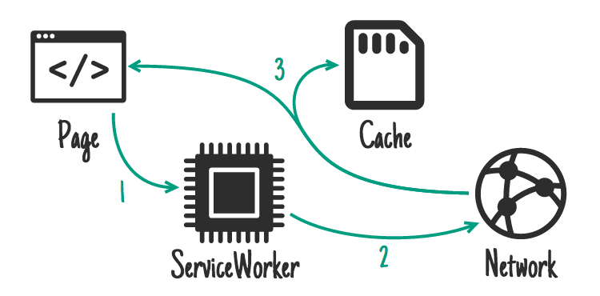

> **Ideal for:** Frequently updating resources such as a user's inbox, or article contents. Also useful for non-essential content such as avatars, but care is needed.

**このパターンが適するのは：**頻繁に更新されるリソース（例：メールの受信箱やブログ記事）、もしくはアプリケーションに必須ではないコンテンツ（例：アバター）等。ただし、注意が必要。（後述）

> If a request doesn't match anything in the cache, get it from the network, send it to the page & add it to the cache at the same time.

このパターンでは、リクエストを処理する際に、キャッシュに見つからなければネットワークから取得し、レスポンスをページに表示するとともにキャッシュにも保存します。

> If you do this for a range of URLs, such as avatars, you'll need to be careful you don't bloat the storage of your origin — if the user needs to reclaim disk space you don't want to be the prime candidate. Make sure you get rid of items in the cache you don't need any more.

しかしながら、このパターンをアバターのような広範囲なURLに対して適用するには注意が必要です。キャッシュに必要なメモリサイズが増加するため、ユーザーがディスクスペースを整理する際に、あなたのアプリケーションは真っ先に削除候補に挙がるでしょう。それを避けるには、不要なキャッシュをこまめに削除しなければいけません。

```js
self.addEventListener('fetch', function(event) {
  event.respondWith(
    caches.open('mysite-dynamic').then(function(cache) {
      return cache.match(event.request).then(function (response) {
        return response || fetch(event.request.clone()).then(function(response) {
          cache.put(event.request, response.clone());
          return response;
        });
      });
    })
  );
});
```

> To allow for efficient memory usage, you can only read a response/request's body once. In the code above, [`.clone()`](https://fetch.spec.whatwg.org/#dom-request-clone) is used to create additional copies that can be read separately.

ここで注意してほしいことは、メモリー使用の最適化のため、`request`および`response`オブジェクトの内容は一回しか読み出せないようになっていることです。上記のコードでは、[`.clone()`](https://fetch.spec.whatwg.org/#dom-request-clone)メソッドを使用することでオブジェクトをコピーして、重複して内容を読み出せるようにしています。

> On [trained-to-thrill](https://jakearchibald.github.io/trained-to-thrill/) I use this to [cache Flickr images](https://github.com/jakearchibald/trained-to-thrill/blob/3291dd40923346e3cc9c83ae527004d502e0464f/www/static/js-unmin/sw/index.js#L109).

サンプルアプリケーションの[trained-to-thrill](https://jakearchibald.github.io/trained-to-thrill/)では、[Flickrの画像をキャッシュに保存](https://github.com/jakearchibald/trained-to-thrill/blob/3291dd40923346e3cc9c83ae527004d502e0464f/www/static/js-unmin/sw/index.js#L109)しています。

###<a name="stale-while-revalidate"></a>Stale-while-revalidate

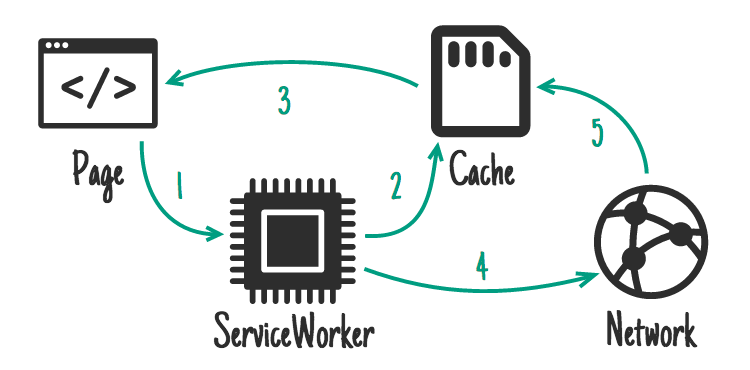

> **Ideal for:** Frequently updating resources where having the very latest version is non-essential. Avatars can fall into this category.

**このパターンが適するのは：**頻繁に更新されるが、必ずしも最新のバージョンである必要がないリソース。アバターはこれに該当する。

> If there's a cached version available, use it, but fetch an update for next time.

このパターンでは、リクエストされたリソースがキャッシュに見つかった場合は、それを使用すると同時に、次回のリクエストに備えてネットワークからも取得しておきます。

```js
self.addEventListener('fetch', function(event) {
  event.respondWith(
    caches.open('mysite-dynamic').then(function(cache) {
      return cache.match(event.request).then(function(response) {
        var fetchPromise = fetch(event.request.clone()).then(function(networkResponse) {
          cache.put(event.request, networkResponse.clone());
          return networkResponse;
        })
        return response || fetchPromise;
      })
    })
  );
});
```

> This is very similar to HTTP's [stale-while-revalidate](https://www.mnot.net/blog/2007/12/12/stale).

このパターンはHTTPの[stale-while-revalidate](https://www.mnot.net/blog/2007/12/12/stale)と非常に似ています。

###<a name="on-push-message"></a>On push message

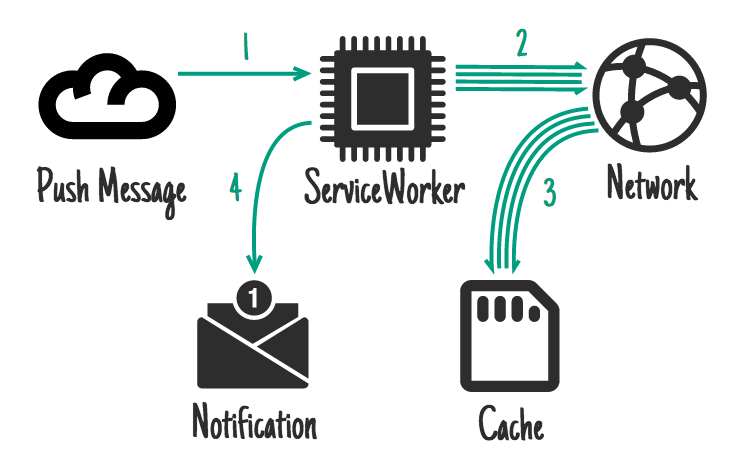

**Note:** Push isn't supported in Chrome yet.

The [Push API](https://w3c.github.io/push-api/) is another feature built on top of SerivceWorker. This allows the ServiceWorker to be awoken in response to a message from the OS's messaging service. This happens even when the user doesn't have a tab open to your site, only the ServiceWorker is woken up. You request permission to do this from a page & the user will be prompted.

**Ideal for:** Content relating to a notification, such as a chat message, a breaking news story, or an email. Also infrequently changing content that benefits from immediate sync, such as a todo list update or a calendar alteration.

The common final outcome is a notification which, when tapped, opens/focuses a relevant page, but updating caches before this happens is extremely important. The user is obviously online at the time of receiving the push message, but they may not be when they finally interact with the notification, so making this content available offline is important. The Twitter native app, which is for the most part an excellent example of offline-first, gets this a bit wrong:

<a href="http://www.youtube.com/watch?feature=player_embedded&v=0i7YdSEQI1w" target="_blank"></a>

Without a connection, Twitter fails to provide the content relating to the push message. Tapping it does remove the notification however, leaving the user with less information than before they tapped. Don't do this!

This code updates caches before showing a notification:

```js
self.addEventListener('push', function(event) {
  if (event.data.text() == 'new-email') {
    event.waitUntil(
      caches.open('mysite-dynamic').then(function(cache) {
        return fetch('/inbox.json').then(function(response) {
          cache.put('/inbox.json', response.clone());
          return response.json();
        });
      }).then(function(emails) {
        registration.showNotification("New email", {
          body: "From " + emails[0].from.name
          tag: "new-email"
        });
      })
    );
  }
});

self.addEventListener('notificationclick', function(event) {
  if (event.notification.tag == 'new-email') {
    // Assume that all of the resources needed to render
    // /inbox/ have previously been cached, e.g. as part
    // of the install handler.
    new WindowClient('/inbox/');
  }
});
```

###<a name="on-background-sync"></a>On background-sync

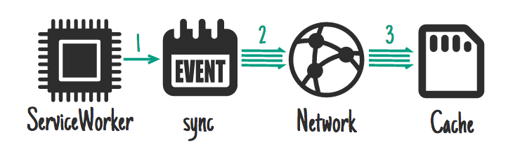

**Note:** Background sync isn't supported in Chrome yet.

[Background sync](https://github.com/slightlyoff/BackgroundSync/blob/master/explainer.md) is another feature built on top of ServiceWorker. It allows you to request background data synchronisation as a one-off, or on an (extremely heuristic) interval. This happens even when the user doesn't have a tab open to your site, only the ServiceWorker is woken up. You request permission to do this from a page & the user will be prompted.

**Ideal for:** Non-urgent updates, especially those that happen so regularly that a push message per update would be too frequent, such as social timelines or news articles.

```js
self.addEventListener('sync', function(event) {
  if (event.id == 'update-leaderboard') {
    event.waitUntil(
      caches.open('mygame-dynamic').then(function(cache) {
        return cache.add('/leaderboard.json');
      })
    );
  }
});
```

##<a name="cache-persistence"></a>キャッシュの持続性

Your origin is given a certain amount of free space to do what it wants with. That free space is shared between all origin storage: LocalStorage, IndexedDB, Filesystem, and of course Caches.

The amount you get isn't spec'd, it will differ depending on device and storage conditions. You can find out how much you've got via:

```js
navigator.storageQuota.queryInfo("temporary").then(function(info) {
  console.log(info.quota);
  // Result: <quota in bytes>
  console.log(info.usage);
  // Result: <used data in bytes>
});
```

However, like all browser storage, the browser is free to throw it away if the device becomes under storage pressure. Unfortunately the browser can't tell the different between those movies you want to keep at all costs, and the game you don't really care about.

To work around this, there's a proposed API, [Storage Durability](https://github.com/slightlyoff/StorageDurability/blob/master/explainer.md):

```js
// From a page:
navigator.requestStorageDurability().then(function() {
  // Hurrah, your data is here to stay!
})
```

Of course, the user has to grant permission. Making the user part of this flow is important, as we can now expect them to be in control of deletion. If their device comes under storage pressure, and clearing non-essential data doesn't solve it, the user gets to make a judgement call on which items to keep and remove.

For this to work, it requires operating systems to treat "durable" origins as equivalent to native apps in their breakdowns of storage usage, rather than reporting the browser as a single item.

##<a name="serving-suggestions-responding-to-requests"></a>リクエスト処理の８つのパターン

It doesn't matter how much caching you do, the ServiceWorker won't use the cache unless you tell it when & how. Here are a few patterns for handling requests:

###<a name="cache-only"></a>Cache only

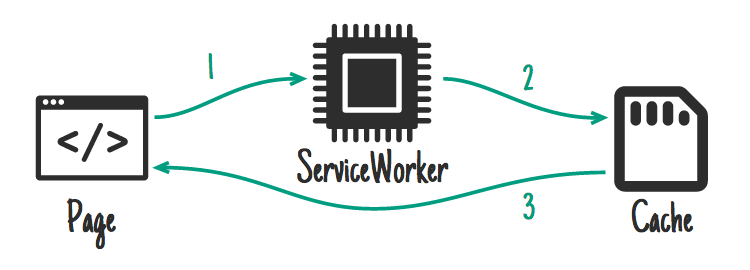

**Ideal for:** Anything you'd consider static to that "version" of your site. You should have cached these in the install event, so you can depend on them being there.

```js
self.addEventListener('fetch', function(event) {
  // If a match isn't found in the cache, the response
  // will look like a connection error
  event.respondWith(caches.match(event.request));
});
```

…although you don't often need to handle this case specifically, ["Cache, falling back to network"](#cache-falling-back-to-network) covers it.

###<a name="network-only"></a>Network only

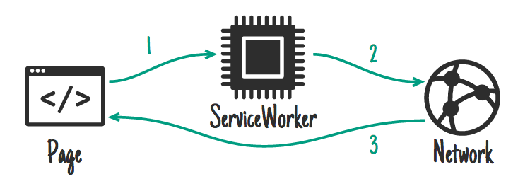

**Ideal for:** Things that have no offline equivalent, such as analytics pings, non-GET requests.

```js
self.addEventListener('fetch', function(event) {
  event.respondWith(fetch(event.request));
  // or simply don't call event.respondWith, which
  // will result in default browser behaviour
});
```

…although you don't often need to handle this case specifically, ["Cache, falling back to network"](#cache-falling-back-to-network) covers it.

###<a name="cache-falling-back-to-network"></a>Cache, falling back to network

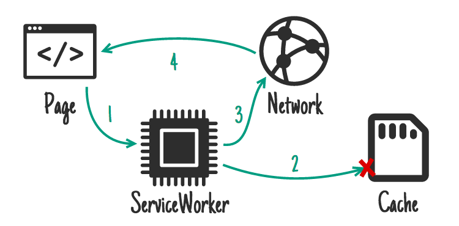

**Ideal for:** If you're building offline-first, this is how you'll handle the majority of requests. Other patterns will be exceptions based on the incoming request.

```js
self.addEventListener('fetch', function(event) {
  event.respondWith(
    caches.match(event.request).then(function(response) {
      return response || fetch(event.request);
    })
  );
});
```

This gives you the "Cache only" behaviour for things in the cache and the "Network only" behaviour for anything not-cached (which includes all non-GET requests, as they cannot be cached).

###<a name="cache-network-race"></a>Cache & network race

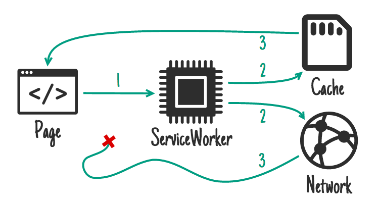

**Ideal for:** Small assets where you're chasing performance on devices with slow disk access.

With some combinations of older hard drives, virus scanners, and faster internet connections, getting resources from the network can be quicker than going to disk. However, going to the network when the user has the content on their device can be a waste of data, so bear that in mind.

```js
// Promise.race is no good to us because it rejects if
// a promise rejects before fulfilling. Let's make a proper
// race function:
function properRace(promises) {
  // we implement by inverting Promise.all
  Promise.all(
    promises.map(function(promise) {
      // for each promise, cast it, then swap around rejection & fulfill
      return Promise.resolve(promise).then(function(val) {
        throw val;
      }, function(err) {
        return err;
      });
    })
  ).then(function(errs) { // then swap it back
    throw Error("Proper race: none fulfilled");
  }, function(val) {
    return val;
  });
}

self.addEventListener('fetch', function(event) {
  event.respondWith(
    properRace([
      caches.match(event.request),
      fetch(event.request)
    ])
  );
});
```

###<a name="network-falling-back-to-cache"></a>Network falling back to cache

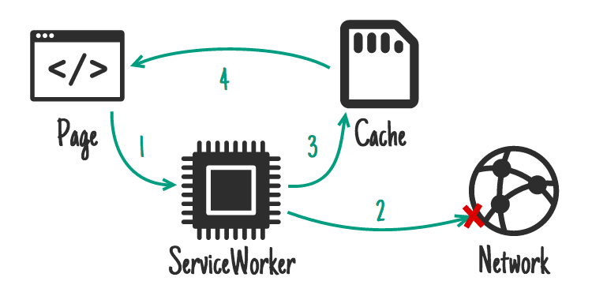

**Ideal for:** A quick-fix for resources that update frequently, outside of the "version" of the site. E.g. articles, avatars, social media timelines, game leader boards.

This means you give online users the most up-to-date content, but offline users get an older cached version. If the network request succeeds you'll most-likely want to [update the cache entry](#on-network-response).

However, this method has flaws. If the user has an intermittent or slow connection they'll have to wait for the network to fail before they get the perfectly acceptable content already on their device. This can take an extremely long time and is a frustrating user experience. See the next pattern, ["Cache then network"](#cache-then-network), for a better solution.

```js
self.addEventListener('fetch', function(event) {
  event.respondWith(
    fetch(event.request).catch(function() {
      return caches.match(event.request);
    })
  );
});
```

###<a name="cache-then-network"></a>Cache then network

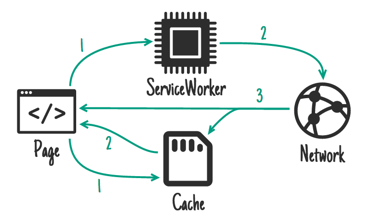

**Ideal for:** Content that updates frequently. E.g. articles, social media timelines, game leaderboards.

This requires the page to make two requests, one to the cache, one to the network. The idea is to show the cached data first, then update the page when/if the network data arrives.

Sometimes you can just replace the current data when new data arrives (e.g. game leaderboard), but that can be disruptive with larger pieces of content. Basically, don't "disappear" something the user may be reading or interacting with.

Twitter adds the new content above the old content & adjusts the scroll position so the user is uninterrupted. This is possible because Twitter mostly retains a mostly-linear order to content. I copied this pattern for [trained-to-thrill](https://jakearchibald.github.io/trained-to-thrill/) to get content on screen as fast as possible, but still display up-to-date content once it arrives.

**Code in the page:**

```js
var networkDataReceived = false;

startSpinner();

// fetch fresh data
var networkUpdate = fetch('/data.json').then(function(response) {
  return response.json();
}).then(function(data) {
  networkDataReceived = true;
  updatePage();
});

// fetch cached data
caches.match('/data.json').then(function(response) {
  if (!response) throw Error("No data");
  return response.json();
}).then(function(data) {
  // don't overwrite newer network data
  if (!networkDataReceived) {
    updatePage(data);
  }
}).catch(function() {
  // we didn't get cached data, the network is our last hope:
  return networkUpdate;
}).catch(showErrorMessage).then(stopSpinner);
```

**Code in the ServiceWorker:**

We always go to the network & update a cache as we go.

```js
self.addEventListener('fetch', function(event) {
  event.respondWith(
    caches.open('mysite-dynamic').then(function(cache) {
      return fetch(event.request.clone()).then(function(response) {
        cache.put(event.request, response.clone());
        return response;
      });
    })
  );
});
```

The above doesn't work in Chrome yet, as we've yet to expose fetch and caches to pages ([ticket #1](https://code.google.com/p/chromium/issues/detail?id=436770), [ticket #2](https://code.google.com/p/chromium/issues/detail?id=439389)).

In [trained-to-thrill](https://jakearchibald.github.io/trained-to-thrill/) I worked around this by using [XHR instead of fetch](https://github.com/jakearchibald/trained-to-thrill/blob/3291dd40923346e3cc9c83ae527004d502e0464f/www/static/js-unmin/utils.js#L3), and abusing the Accept header to tell the ServiceWorker where to get the result from ([page code](https://github.com/jakearchibald/trained-to-thrill/blob/3291dd40923346e3cc9c83ae527004d502e0464f/www/static/js-unmin/index.js#L70), [ServiceWorker code](https://github.com/jakearchibald/trained-to-thrill/blob/3291dd40923346e3cc9c83ae527004d502e0464f/www/static/js-unmin/sw/index.js#L61)).

###<a name="generic-fallback"></a>Generic fallback

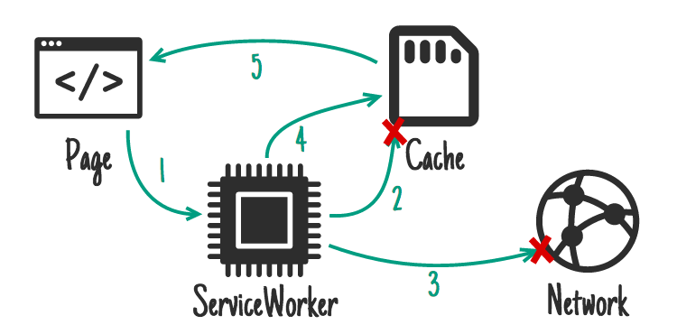

If you fail to serve something from the cache and/or network you may want to provide a generic fallback.

**Ideal for:** Secondary imagery such as avatars, failed POST requests, "Unavailable while offline" page.

```js
self.addEventListener('fetch', function(event) {
  event.respondWith(
    // Try the cache
    caches.match(event.request).then(function(response) {
      // Fall back to network
      return response || fetch(event.request);
    }).catch(function() {
      // If both fail, show a generic fallback:
      return caches.match('/offline.html');
      // However, in reality you'd have many different
      // fallbacks, depending on URL & headers.
      // Eg, a fallback silhouette image for avatars.
    })
  );
});
```

The item you fallback to is likely to be an [install dependency](#on-install-as-a-dependency).

If your page is posting an email, your ServiceWorker may fall back to storing the email in an IDB 'outbox' & respond letting the page know that the send failed but the data was successfully retained.

###<a name="serviceworker-side-templating"></a>ServiceWorker-side templating

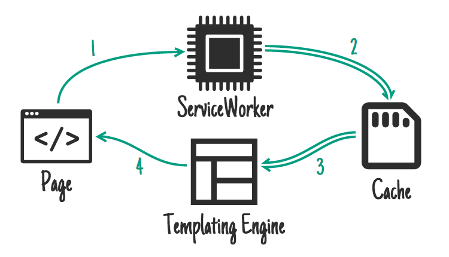

**Ideal for:** Pages that cannot have their server response cached.

[Rendering pages on the server makes things fast](http://jakearchibald.com/2013/progressive-enhancement-is-faster/), but that can mean including state data that may not make sense in a cache, e.g. "Logged in as…". If your page is controlled by a ServiceWorker, you may instead choose to request JSON data along with a template, and render that instead.

```js
importScripts('templating-engine.js');

self.addEventListener('fetch', function(event) {
  var requestURL = new URL(event.request);

  event.respondWith(
    Promise.all([
      caches.match('/article-template.html').then(function(response) {
        return response.text();
      }),
      caches.match(requestURL.path + '.json').then(function(response) {
        return response.json();
      })
    ]).then(function(responses) {
      var template = responses[0];
      var data = responses[1];

      return new Response(renderTemplate(template, data), {
        headers: {
          'Content-Type': 'text/html'
        }
      });
    })
  );
});
```

##<a name="putting-it-together"></a>まとめ

You don't have to pick one of these methods, you'll likely use many of them depending on request URL. For example, [trained-to-thrill](https://jakearchibald.github.io/trained-to-thrill/) uses:

* [Cache on install](#on-install-as-a-dependency), for the static UI and behaviour
* [Cache on network response](#on-network-response), for the Flickr images and data
* [Fetch from cache, falling back to network](#cache-falling-back-to-network), for most requests
* [Fetch from cache, then network](#cache-then-network), for the Flickr search results

Just look at the request and decide what to do:

```js
self.addEventListener('fetch', function(event) {
  // Parse the URL:
  var requestURL = new URL(event.request.url);

  // Handle requests to a particular host specifically
  if (requestURL.hostname == 'api.example.com') {
    event.respondWith(/* some combination of patterns */);
    return;
  }
  // Routing for local URLs
  if (requestURL.origin == location.origin) {
    // Handle article URLs
    if (/^\/article\//.test(requestURL.pathname)) {
      event.respondWith(/* some other combination of patterns */);
      return;
    }
    if (/\.webp$/.test(requestURL.pathname)) {
      event.respondWith(/* some other combination of patterns */);
      return;
    }
    if (request.method == 'POST') {
      event.respondWith(/* some other combination of patterns */);
      return;
    }
    if (/cheese/.test(requestURL.pathname)) {
      event.respondWith(
        new Response("Flagrant cheese error", {
          status: 512
        })
      );
      return;
    }
  }

  // A sensible default pattern
  event.respondWith(
    caches.match(event.request).then(function(response) {
      return response || fetch(event.request);
    })
  );
});
```

…you get the picture.

If you come up with additional patterns, throw them at me in the comments!

##<a name=""></a>著作権

…for the lovely icons:

* [Code](http://thenounproject.com/term/code/17547/) by buzzyrobot
* [Calendar](http://thenounproject.com/term/calendar/4672/) by Scott Lewis
* [Network](http://thenounproject.com/term/network/12676/) by Ben Rizzo
* [SD](http://thenounproject.com/term/sd-card/6185/) by Thomas Le Bas
* [CPU](http://thenounproject.com/term/cpu/72043/) by iconsmind.com
* [Trash](http://thenounproject.com/term/trash/20538/) by trasnik
* [Notification](http://thenounproject.com/term/notification/32514/) by [@daosme](http://thenounproject.com/flylion/)
* [Layout](http://thenounproject.com/term/layout/36872/) by Mister Pixel
* [Cloud](http://thenounproject.com/term/cloud/2788/) by P.J. Onori

And thanks to [Jeff Posnick](https://twitter.com/jeffposnick) for catching many howling errors before I hit "publish".

##<a name=""></a>参考文献

* [Intro to ServiceWorkers](http://www.html5rocks.com/ja/tutorials/service-worker/introduction/)
* [Is ServiceWorker ready?](https://jakearchibald.github.io/isserviceworkerready/) - track the implementation status across the main browsers
* [JavaScript promises, there and back again](http://www.html5rocks.com/ja/tutorials/es6/promises/) - guide to promises
